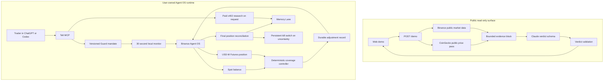

# Telt

Telt is an autonomous position guardian built with Binance Agent OS.

A Spot hedge becomes stale when the holding changes after the trader walks away. Telt solves that specific problem. The trader approves a bounded Guard Mode mandate once, then Telt watches the Spot holding and its isolated USD-M Futures hedge, adjusts the short when coverage drifts, verifies the resulting position, and records the decision in Memory Lane.

[Try the public agent](https://telt.site/#demo) | [Connect an MCP client](https://telt.site/connect) | [Verify a receipt](https://telt.site/verify)

## The problem

Most trading assistants answer questions or place a requested order. They stop when the chat stops.

A hedge needs care after it opens. Buying more Spot creates an underhedged position. Selling Spot can leave the account overhedged. A dropped connection can leave an order outcome unknown. The trader must keep checking both markets or accept that the protection may no longer match the position.

Telt turns that ongoing job into one inspectable mandate.

> Approve the limits once. Telt keeps the hedge inside them and stops when it cannot prove the account state.

## The Guard Mode loop

1. The trader names a USDT pair, target coverage, margin multiple, and expiry. Telt shows the operator-set notional caps before approval.
2. Telt stores a versioned mandate. The mandate can be inspected or revoked at any time.
3. The local daemon reads the real Spot balance and matching USD-M Futures position through Binance Agent OS.
4. A deterministic controller classifies the position as `protected`, `underhedged`, `overhedged`, `unprotected`, or `unknown`.
5. Telt applies the Futures lot size, minimum position value, cooldown, per-position cap, and Guard portfolio caps.
6. It writes a durable operation before sending an adjustment. Increases use an isolated short. Reductions use a reduce-only order.
7. Telt checks the final Futures quantity against the expected position. Partial, unknown, conflicting, or stale states engage the kill switch.
8. Memory Lane records the mandate, checks, adjustments, paid investigations, failures, and revocation.

The model explains what happened. It does not decide whether protection is required and cannot override the controller.



## Why Binance Agent OS matters

Agent OS is the account and execution layer. The local Telt process uses the trader's own Agent OS session to read Spot balances, inspect USD-M Futures positions, change the permitted hedge, and verify the result. Account credentials stay in the user's environment.

By default, the hosted MCP endpoint and public website carry no Binance account credential. They are safe surfaces for anyone to inspect the agent without receiving the operator's token.

## What is built

| Capability | Current behavior |
| --- | --- |
| Guard Mode | Stores a versioned mandate with target coverage, tolerance, cap, margin multiple, cooldown, and expiry |
| Position monitoring | Runs in the local daemon every 30 seconds and can be forced with `telt_check_positions` |
| Automatic adjustment | Opens, increases, or reduces the permitted isolated Futures short when coverage leaves the tolerance band |
| Exchange rules | Applies the live Futures quantity step, minimum quantity, maximum quantity, and minimum position value |
| Risk gates | Enforces a per-hedge ceiling plus aggregate Spot and hedge ceilings across active Guard symbols |
| Durable execution | Records the adjustment before sending it and uses a deterministic Binance client order ID |
| Fill verification | Compares the live position after an order with the exact quantity Telt expected |
| Restart safety | Mandates, monitor checkpoints, kill-switch state, and adjustment records survive restarts. An interrupted adjustment halts the next runtime for reconciliation |
| Manual hedge flow | Builds a reviewable Spot-to-Futures hedge proposal and requires a one-use confirmation code |
| Protection Watch | Reads both legs for free and reports current coverage, net exposure, and Futures PnL |
| Memory Lane | Renders the protection lifecycle from the durable local journal |
| Paid research | Buys outside context only when requested, records the cost, and never controls the hedge |
| Public demo | Reads live Binance data, corroborates it with a free CoinGecko price pass, and returns a checked Claude verdict without account or order access |
| Receipt verifier | Checks the EIP-191 signature over displayed claims in the browser and states what the signature does not prove |

The execution path is pair-driven, not hardcoded to four assets. It accepts an uppercase Binance USDT pair when the configured symbol policy allows it and the same pair trades on Spot and USD-M Futures. A fresh install defaults to `ETHUSDT` and `BTCUSDT`; set `TELT_ALLOWED_SYMBOLS=*` or provide a comma-separated list to enable other pairs. Spot-only pairs and pairs outside policy are refused. The public web demo currently uses BTC, ETH, BNB, and SOL as its second-source examples. That demo mapping is separate from the local trading engine's symbol policy.

## Use Telt conversationally

Connect a local MCP client and speak normally:

```text
Guard my SOL at 100% coverage and 2x for the next 24 hours.
Check my protection now.
Why did Telt adjust the hedge?
Investigate the SOL market and add the result to my Memory Lane.
Show my SOL Memory Lane.
Revoke SOL Guard Mode.
```

The MCP instructions map those requests to the correct tools. Read-only checks run without extra confirmation. Telt explains the mandate boundary before `telt_guard_arm`, and that call requires the user's approval. Manual Spot and Futures entries still use one-use confirmation codes.

### Hosted MCP for public inspection

Anyone can add this endpoint to a compatible MCP client:

```text
https://mcp.telt.site/mcp
```

The no-account connection exposes public market checks, Telt capability discovery, and receipt verification. It has no trading authority and does not open a Binance login flow.

Binance's official MCP prompts users to authorize Agent OS and creates an Agentic sub-account during onboarding when needed. Telt does not yet pass that authorization into its hosted 30-second monitor. Full Guard Mode therefore runs in the user's local Telt process with the user's own Agent OS session. Do not paste an account token into ChatGPT or a website form.

### Local MCP with Agent OS

Install and verify the project:

```bash
npm ci
npm run check
npm run prove
```

Point the MCP client at the built server:

```text
Command: node
Argument: /absolute/path/to/kertel/apps/telt/dist/mcp.js
```

Start in fixture mode. Configure the local environment only when the fixture loop is clear. The main settings are documented in [.env.example](.env.example):

```text
TELT_MODE=live
TELT_BINANCE_MCP_TOKEN=...
TELT_LIVE_EXECUTION=true
TELT_MAX_LEVERAGE=3
TELT_MAX_FUTURES_NOTIONAL=50
TELT_MAX_TOTAL_EXPOSURE=50
TELT_MAX_TOTAL_HEDGE_NOTIONAL=50
```

Keep tokens, keys, local databases, demo notes, audit reports, and assistant workspaces outside Git. Telt loads `.env` in the local MCP process. Do not paste credentials into a website, screenshot, repository, or chat message.

## Public demo

The homepage demonstrates the reasoning boundary without an account:

1. The backend reads a fresh public Binance book.
2. It fetches a second public price and 24-hour change from CoinGecko.
3. It sends only the bounded evidence to Claude, never the visitor's wording as evidence.
4. The model response must match Telt's verdict schema.
5. The browser shows the provider status, observed times, execution trace, risks, confidence, and no-order boundary.

This is free read-only corroboration. Smart-money flow research remains a local MCP capability that spends the caller's own x402 budget. The public route has no account, research-wallet, or order capability.

## Research and Memory Lane

Protection checks spend nothing. A paid investigation runs only when the user asks for market context. Telt can use CoinGecko, CoinMarketCap, Nansen, The Graph, or OpenPulse when the symbol has a verified provider mapping and the configured x402 budget permits the call.

Missing provider coverage does not weaken the hedge controller. Telt reports that the outside evidence is unavailable and continues to use Binance account facts for protection. Research cannot open, resize, close, delay, or veto a hedge.

Memory Lane converts journal rows into a readable position history. An MCP client with Agent Memory can carry that history between sessions without giving Telt a memory credential.

## Safety model

- Live orders require both `TELT_MODE=live` and `TELT_LIVE_EXECUTION=true`.
- Guard Mode needs a current, unexpired mandate for the exact symbol.
- Existing Futures longs and cross-margin positions are refused by the protective-short controller.
- Every increase sets isolated margin and the approved margin multiple before the order.
- Every reduction is reduce-only.
- A deterministic client order ID prevents blind duplicate submission.
- Partial fills, transport uncertainty, unexpected final quantities, stale reads, and restart-time pending operations engage the persistent kill switch.
- Paid research has per-call, per-run, and daily caps.
- Discretionary live entries stay paused because account-wide realised loss accounting is not complete.

A hedge reduces directional exposure. It does not guarantee a fill price, profit, breakeven result, or protection from liquidation. Fees, funding, basis, and later Spot changes can create drift.

## Current limits and roadmap

The current Guard portfolio totals active Guard symbols. It does not discover and price every unguarded asset or every unrelated Futures position in the account. Account-wide realised loss is also unavailable.

The monitor uses 30 second polling. WebSocket event intake and transition notifications are not built. If a process stops after an order is sent but before the result is stored, the next runtime halts. Automatic exchange-order recovery remains roadmap work, so the operator must reconcile that state before resuming.

Next work:

- add a supported Agent OS authorization handoff and a user-owned hosted Guard runtime
- discover and price all account assets and open Futures positions for full-account risk totals
- reconcile interrupted Agent OS orders by deterministic client order ID
- add WebSocket events with polling reconciliation
- send protection, halt, and mandate-expiry notifications
- measure hedge drift, fees, funding, and basis over complete lifecycles

## Verify the build

```bash
npm run typecheck
npm run test
npm run prove
node scripts/build-verifier.mjs
cd web && npm run build
```

`npm run prove` uses recorded provider responses, a public test key, a fixed clock, and an in-memory database. It makes no network call, payment, or order. The generated fixture powers the offline proof and browser verifier.

The browser verifier proves that the displayed fields match the claimed signer. It does not independently prove provider origin, x402 settlement, order execution, or chronology. Those claims require their own external records.

## Repository map

```text
apps/telt/          MCP server, daemon, Guard controller, execution and journal
packages/core/      fixed-point math, policies, mandates, receipts and verdicts
packages/providers/ paid and free research adapters behind one provider seam
packages/x402/      x402 rail selection, payments, fixtures and attestations
web/                public demo, connection guide and browser verifier
scripts/            reproducible proof and live read-only probes
fixtures/           recorded exchange and provider responses for offline tests
```

[Architecture](docs/ARCHITECTURE.md) | [MCP setup](https://telt.site/connect)
